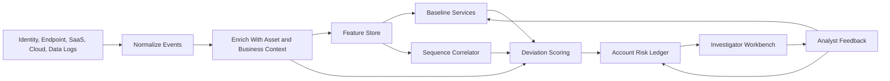

# Behavioral Security System

This repository is a design packet for a UEBA-style account risk system. It starts from a practical SOC problem: an account can look ordinary for weeks, then begin touching just enough unfamiliar systems that no single log line feels worth escalating.

The design turns those drift patterns into an explainable case for a human analyst. It uses user baselines, peer comparisons, resource sensitivity, temporal correlation, and business context so the system can separate "new but expected" from "new and risky."

## What This Includes

- A reference architecture for behavioral account monitoring.
- A scoring model that combines event rarity, asset sensitivity, context, and sequence risk.
- A playbook for how analysts review and close alerts.
- Example normalized telemetry and an example alert payload.

This is not production detection code. Treat it as a design brief, architecture proposal, or starting point for a prototype.

## Problem

Compromised and malicious accounts rarely announce themselves with one perfect signal. A suspicious transition is usually assembled from smaller changes:

- a new device after a password reset
- first-time access to a repository or storage bucket
- unusual searches for secrets or deployment notes
- temporary privilege elevation
- bulk reads from a sensitive system
- activity that does not match a ticket, project, travel record, or role change

The system does not wake an analyst for every unfamiliar action. It escalates when enough evidence shows that an account has moved outside its normal operating lane, especially when the assets involved have real blast radius.

## Design Principles

- Model behavior at several levels: account, peer group, resource, time, and privilege.
- Score transitions, not just isolated events.
- Keep context useful but bounded. A new project can explain some access; it does not explain unrelated credential downloads.
- Delay baseline learning for suspicious activity so an attacker cannot normalize their own behavior too quickly.
- Produce alerts that say exactly what changed, why it matters, and what the analyst can check next.

## Architecture



## Available Signals

The model expects signals from systems most mid-size security teams already collect:

- Identity: SSO, MFA, password resets, OAuth grants, session metadata.
- Device and network: managed state, EDR posture, ASN, VPN, impossible travel.
- Access: applications, repositories, file shares, databases, cloud accounts.
- Privilege: role assignments, group changes, temporary elevation, admin console use.
- Data movement: exports, downloads, sharing links, mailbox rules, bulk reads.
- Business context: HR role updates, tickets, project membership, travel, calendar, on-call rotation.
- Asset context: owner, sensitivity label, production status, regulated data class.

## Account Risk Ledger

Each account has a small risk ledger that changes over time:

```text
account_id
risk_state
active_anomalies
supporting_events
baseline_comparisons
context_matches
context_gaps
risk_decay_timer
analyst_feedback
```

The ledger is intentionally simple. It gives the correlator somewhere to hold weak evidence until the pattern either fades, gets explained by context, or becomes strong enough for investigation.

## Example Transition

A marketing manager normally works from Boston and uses CRM, analytics, and shared drive tools.

On Thursday morning UTC, the same account:

1. Signs in from a new unmanaged device.
2. Opens a production deployment repository for the first time.
3. Searches internal docs for "deploy key" and "storage credentials."
4. Receives temporary cloud admin access.
5. Downloads 700 MB from a critical object storage path.

The alert is not "new device equals compromise." The alert is "new device plus first-time engineering access plus secret-oriented search plus privileged bulk download, with no matching ticket or project assignment."

## Repository Contents

- `docs/architecture.md`: ingestion, enrichment, baseline services, and analyst workflow.
- `docs/detection-model.md`: scoring logic, transition mode, sequence patterns, and false-positive controls.
- `docs/investigation-playbook.md`: triage questions, review workflow, response actions, and feedback labels.
- `docs/assumptions-and-tradeoffs.md`: design assumptions, tradeoffs, failure modes, and first-prototype scope.
- `examples/sample-events.jsonl`: normalized events for the example transition.
- `examples/sample-alert.json`: investigator-facing alert payload.

## How To Use This

Use the README for a quick demo. Use the docs folder for a deeper walkthrough. The example files are there to show how raw activity becomes an explainable alert rather than a pile of disconnected log entries.
