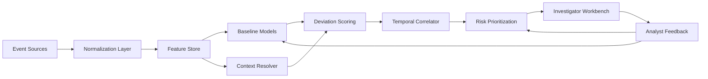

# Behavioral Security System

A system design blueprint for detecting suspicious account behavior by combining user baselines, contextual signals, temporal correlation, and investigator-friendly explanations.

The goal is not to label every unusual event as malicious. The goal is to detect when an account is becoming meaningfully different from its normal operating pattern, especially when that transition touches sensitive systems, privileges, or data.

## Problem

Compromised and malicious accounts often begin with ordinary-looking activity. A login from a new device, a first-time file access, or a role change may be low risk on its own. Over time, however, these small changes can form a suspicious pattern:

- access to unfamiliar systems
- privilege expansion
- unusual data movement
- activity outside normal time or location patterns
- sensitive resource access without matching business context

Security teams need a system that can connect these signals while controlling false positives.

## Design Goals

- Establish adaptive baselines for users, peers, resources, and roles.
- Detect sudden and gradual behavior changes across multiple time windows.
- Correlate weak signals into stronger behavioral narratives.
- Incorporate legitimate context such as new projects, role changes, travel, and on-call work.
- Prioritize alerts by investigation value and potential impact.
- Explain why an account became suspicious in plain language.

## Architecture



## Signal Sources

- Identity: SSO, MFA, password resets, session metadata, OAuth grants.
- Endpoint: device posture, managed state, EDR findings, browser and process telemetry.
- Access: applications, repositories, files, databases, cloud accounts, SaaS workspaces.
- Privilege: role assignments, group changes, temporary elevation, admin actions.
- Data movement: exports, downloads, sharing links, mailbox rules, bulk reads.
- Business context: HR role changes, tickets, project membership, travel, calendar, on-call rotation.
- Asset context: sensitivity labels, ownership, production status, regulatory classification.

## Core Concept

The system maintains a behavioral risk ledger per account:

```text
account_id
current_risk_state
active_anomalies
supporting_events
baseline_comparisons
business_context
risk_decay_timer
analyst_feedback
```

Risk increases when independent signals reinforce each other. Risk decays when behavior returns to normal or legitimate context explains the change.

## Example

A marketing user usually works from Boston and rarely accesses engineering systems.

Over three days, the account:

1. Logs in from a new unmanaged device.
2. Accesses source control for the first time.
3. Searches internal docs for deployment credentials.
4. Receives temporary cloud admin access.
5. Downloads sensitive storage objects after midnight.

No single event proves compromise. Together, the account has crossed identity, access, privilege, data, and time-based boundaries without matching project or ticket context. The system escalates the account for investigation and explains the contributing evidence.

## Repository Contents

- `docs/architecture.md`: system components and data flow.
- `docs/detection-model.md`: baselines, scoring, correlation, and false-positive controls.
- `docs/investigation-playbook.md`: alert review workflow for analysts.
- `examples/sample-events.jsonl`: representative normalized events.
- `examples/sample-alert.json`: example investigator-facing alert payload.

## Status

This is a design blueprint, not a production implementation. It can be used as a starting point for a security analytics platform, UEBA prototype, detection engineering proposal, or product requirements document.
